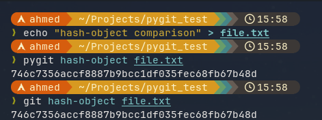
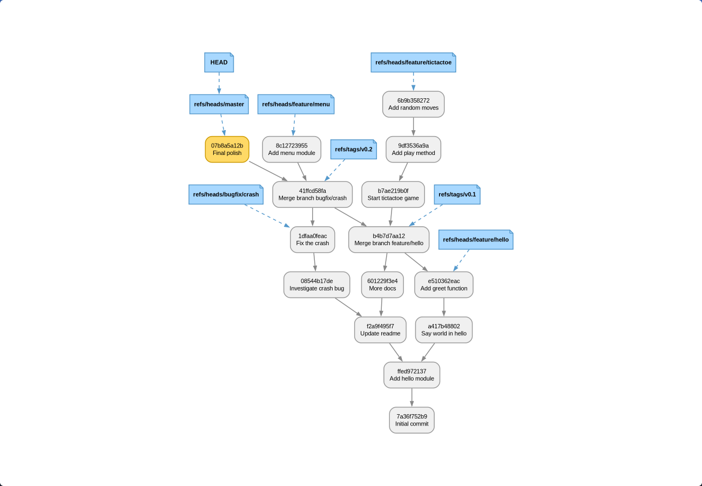

# pygit

A version control system (Git wannabe) written in Python, built to understand how Git actually works under the hood.

`pygit` reimplements Git's core internals — content-addressed objects, trees, commits, branches, merging, and a basic filesystem-based remote — in plain Python. It's a learning project, not a production VCS: don't use it for anything you care about, but do read the source if you want to understand what `.git` is actually doing.

## Features

- Content-addressed object store (blobs, trees, commits), zlib-compressed and hashed the same way Git does
- Staging index, commits, branches, tags
- `diff` and three-way `merge` (via the system `diff`/`diff3` tools)
- Fast-forward and non-fast-forward merges with conflict markers
- Basic filesystem remotes: `fetch` / `push`
- `.pygitignore` support (directory, glob, and exact-name patterns)
- A commit graph visualizer (`pygit vis`) via Graphviz

## Usage

### Porcelain commands

These are the user-facing commands — the ones you'd use day-to-day to interact with your repository, just like their Git counterparts.

| Command | Example | Description |
|---------|---------|-------------|
| `init` | `pygit init` | Create an empty pygit repository in the current directory |
| `add` | `pygit add file.txt` | Stage files or directories for the next commit |
| `commit` | `pygit commit -m "msg"` | Record staged changes as a new commit |
| `status` | `pygit status` | Show the current branch and pending changes (staged vs unstaged) |
| `log` | `pygit log` | Print commit history from HEAD backwards |
| `checkout` | `pygit checkout feature` | Switch the working directory and HEAD to a branch or commit |
| `branch` | `pygit branch` / `pygit branch feature` | List branches, or create a new one at HEAD |
| `tag` | `pygit tag v1.0` | Create a named tag pointing at the current commit |
| `diff` | `pygit diff` / `pygit diff --cached` | Show changes between working tree, index, or a commit |
| `show` | `pygit show` | Show a commit's message and the diff it introduced |
| `reset` | `pygit reset <commit>` | Move HEAD to a commit without changing the working directory |
| `merge` | `pygit merge feature` | Merge a branch into the current branch (fast-forward or 3-way) |
| `merge-base` | `pygit merge-base a b` | Find the common ancestor of two commits |
| `vis` | `pygit vis` | Render the commit graph with Graphviz |

A typical workflow:

```bash
pygit init
echo "hello" > file.txt
pygit add file.txt
pygit commit -m "first commit"
```

Branching and merging:

```bash
pygit branch feature
pygit checkout feature
# ... make changes, stage, commit ...
pygit checkout master
pygit merge feature
```

See `pygit --help` or `pygit <command> --help` for the full command list.

### Plumbing commands

These are the low-level building blocks that the porcelain commands call under the hood. They expose Git's internal object model directly — useful for understanding how data is stored and retrieved.

| Command | Example | Description |
|---------|---------|-------------|
| `hash-object` | `pygit hash-object file.txt` | Compute the SHA-1 hash of a file and store it as a blob object |
| `cat-file` | `pygit cat-file <oid>` | Print the raw content of any stored object |
| `write-tree` | `pygit write-tree` | Write the current staging index as a tree object |
| `read-tree` | `pygit read-tree <oid>` | Replace the index with the contents of a tree object |
| `fetch` | `pygit fetch /path/to/remote` | Download commits and objects from a remote pygit repository |
| `push` | `pygit push /path/to/remote master` | Upload commits and update a branch on a remote repository |

The plumbing/porcelain split mirrors how Git itself is designed: porcelain commands are the human interface, plumbing commands are the stable low-level API they compose on top of.

## How it works

### Object storage

pygit stores data the same way Git does: each object is a blob of `<type> <size>\x00<content>`, hashed with SHA-1 and compressed with zlib. The `hash-object` command is functionally identical to `git hash-object`:

```bash
# With Git:
$ git hash-object file.txt
8178c76d11e59382e3489d8237e3a9d28c534673

# With pygit:
$ pygit hash-object file.txt
8178c76d11e59382e3489d8237e3a9d28c534673
```

The hash is deterministic — given the same file content, both Git and pygit produce the same SHA-1. The object is then stored at `.pygit/objects/<hash>` (analogous to `.git/objects/<hash>`), zlib-compressed.



### Commit graph visualization

The `pygit vis` command generates a Graphviz DOT graph of your commit history and renders it. HEAD is highlighted in yellow, branches and tags are shown as labeled nodes, and commits are boxes with their short OID and message.

```bash
pygit vis
```



## Requirements

- Python 3.8+
- [Graphviz](https://graphviz.org/download/) (`dot` binary) — only needed for `pygit vis`
- `diff` and `diff3` (present by default on most Linux/macOS systems) — needed for `pygit diff` and `pygit merge`

## Installation

### From a release (recommended for users)

Download the wheel from the [Releases page](https://github.com/3brady/pygit/releases) and install it with pip:

```bash
pip install https://github.com/3brady/pygit/releases/download/v1.0.0/pygit-1.0.0-py3-none-any.whl
```

### From source (for contributing / development)

```bash
git clone https://github.com/3brady/pygit.git
cd pygit
python3 -m venv env
source env/bin/activate
pip install -r requirements.txt
pip install -e .
```

After that, run `pygit` to try it out.

## Contributing

Issues and pull requests are welcome. This project exists mainly to explore Git internals, so contributions that improve clarity, correctness, or test coverage are especially appreciated.

## License

Apache License 2.0 — see [LICENSE](LICENSE).
